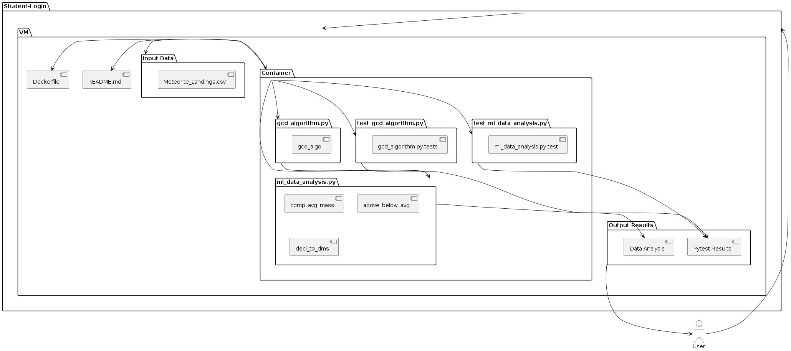

# Meteorite Landing Data Analysis

This homework assignment analyzes NASA's Meteorite Landing dataset using Python3 and provides scripts to read and summarize the data in various ways, such as
determining whether a Meteorite's Mass is above or below average, converting Decimal Notation of Geolocation to Degrees, Minutes, and Seconds (DMS), and 
determining the distance between two Meteorite Landings using the Great-Circle Distance Algorithm.

## Scripts

- ml_data_analysis.py - reads 'Meteorite_Landings.csv' file and prints summary statistics
- gcd_algorithm.py - Composed of Great Circle Distance Algorithm to determine the distance between 2 Landing Sites
- test_ml_data_analysis.py - Unit Tests for ml_data_analysis.py
- test_gcd_algorithm.py - Unit Tests for gcd_algorithm.py

## Instructions

### Running the Code
Ensure the Meteorite_Landings.csv file is in Repository Folder

#### 1. Building the Image for the Dockerfile
In the directory with the downloaded scripts, build the Docker Image with the following code:
```
docker build -t ml_data_container
```
This creates a Docker Image called "ml_data_container"

#### 2. Run the containerized Python Scripts Non-Interactively:
Use the following line of code to mount the "Meteorite_Landings.csv" data inside the container and run the Data Analysis:
```
docker run --rm -v $PWD/Meteorite_Landings.csv:/data/Meteorite_Landings.csv ml_data_container ml_data_analysis.py /data/Meteorite_Landings.csv
```
The "gcd_algorithm.py" script can be run with the following code, but will not print output since it only containers a function imported into "ml_data_analysis.py"
```
docker run --rm -v $PWD/Meteorite_Landings.csv:/data/Meteorite_Landings.csv ml_data_container python /code/gcd_algorithm.py
```

#### 3, Run the containerized Unit Tests Non-Interactively:
Use the following lines of code to run unit tests for the two previous scripts, "ml_data_analysis.py" and "gcd_algorithm.py":
```
docker run --rm -v $PWD/Meteorite_Landings.csv:/data/Meteorite_Landings.csv ml_data_container pytest /code/test_ml_data_analysis.py
docker run --rm -v $PWD/Meteorite_Landings.csv:/data/Meteorite_Landings.csv ml_data_container pytest /code/gcd_algorithm.py
```

The output results are based off the following method explanations:

### Method Explanations for ml_data_analysis.py:
1. comp_avg_mass - computes the average mass of all the meteorites within the dataset.
2. above_below_avg - determines which meteorites in the dataset are either above, below, or equal to the average mass.
```
from ml_data_analysis import above_below_avg, comp_avg_mass

sample_data = [{'mass (g)]: 10}, {'mass (g)': 20}, {'mass (g)': 30}]
mass_avg = comp_avg_mass(data, 'mass (g)')
mass_status = above_below_avg(data, 'mass (g)')
print(mass_avg) # Output: 20.0
print(mass_status) # Output: {10.0: 'Mass Below Average', 20.0: 'Mass Equal To Average', 30.0: 'Mass Above Average'}
```
4. deci_to_dms - converts the decimal notation of longitude and latitude for each meteorite to DMS (Degrees, Minutes, Seconds)
```
from ml_data_analysis import deci_to_dms
lat_dms, long_dms = deci_to_dms(23.673, 32.764)
print(lat_dms) # Output: D = 23, M = 40, S = 22.8
print(long_dms) # Output: D = 32, M = 45, S = 50.4
```
### Method Explanation for gcd_algorithm.py (imported to ml_data_algorithm.py):
1. gcd_algo - determines the distance between two meteorite landing sites based on the radius of the Earth.
```
from gcd_algorithm import gcd_algo
dist = gcd_algo(12.4, 34.6, 64.3, -32.5)
print(dist) # Output: Distance in Kilometers
```
### Method Explanation for test_ml_data_analysis.py
1. test_comp_avg_mass - tests various valid inputs to ensure the function works properly.
2. test_comp_avg_mass_exceptions - inputs invalid data to ensure exceptions occur.
3. test_above_below_avg - tests various valid inputs to ensure the function works properly.
4. test_above_below_avg_exceptions - inputs invalid data to ensure exceptions occur.
5. test_deci_to_dms - tests various valid inputs to ensure the function works properly.
6. test_deci_to_dms_exceptions - inputs invalid data to ensure exceptions occur.

### Method Explanations for test_gcd_algorithm.py
1. test_gcd_algo - tests various valid inputs to ensure the function works properly.
2. test_gcd_algo_exceptions - inputs invalid data to ensure exceptions occur.

## Data Source

The Meteorite Landings Dataset contains information about meteorites that have fallen to Earth, including their name, classification, mass (g), and geolocation.

[NASA Meteorite Landing Dataset](https://data.nasa.gov/Space-Science/Meteorite-Landings/gh4g-9sfh/about_data)
[Meteorite_Landing.csv Adapted - Used for this code](https://github.com/TACC/coe-332-sp25/tree/main/docs/unit02/sample-data)

## Software Diagram
This diagram illustrates the process of a meteorite landing analysis, showing the relationships between the Docker container, Python scripts, and volume-mounted data (input data). The system consists of analysis scripts (ml_data_analysis.py and gcd_algorithm.py) and their corresponding unit tests, running non-interactively within a data container that accesses meteorite landing data through a volume mount.


