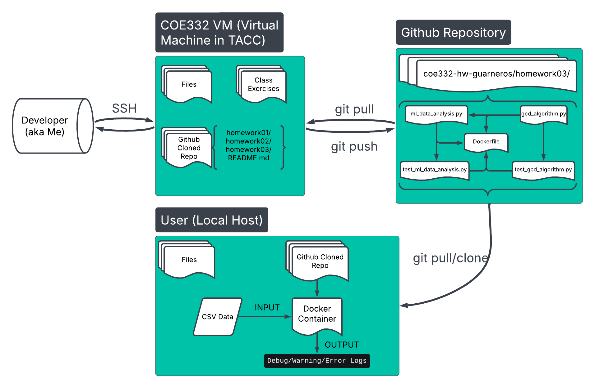

# Homework 3: Containerizing list organizer, shortest distance, great circle distance, and counting instances functions into a Docker container. 

## Table of Contents
1. [Description](README.md#description)
2. [Software Diagram](README.md#software-diagram)
2. [Getting Started](README.md#getting-started)
3. [Running it with Docker](README.md#docker-usage)
4. [Running it without Docker](README.md#running-scripts-without-docker)
9. [Resources](README.md#resources)
10. [AI Usage](README.md#ai-usage)
11. [Miscellaneous](README.md#miscellaneous-notes)

## Description

This code takes in a csv file as an input and formats it as a list of dictionaries for analysis. The ml_data_analysis python script contains three functions of the names: 
* short_dist_calc - measures shortest distance between a number of points and your current position using the great circle distance algorithm. 
* high_to_low_mass - reorders a list from highest to lowest by analyzing a certain key. 
* count_instances - counts the number of appearances of a certain value in a key of a list of dictionaries. 

The gcd_algorithm.py script uses the great circle distance formula to calculate the shortest distance between 2 points on a sphere. 

This code exists to illustrate a functional script formatted with logging and error handling. It also uses pytest and try/excepts. 

This code is necessary when you have a big data set with multiple dictionaries and you want to run some analysis on it. It facilitates running some calculations of big data sets. 

## Software Diagram



This diagram shows a typical workflow focused around the files of homework03. The developer has access to a VM through SSH where they have access to a copy of this GitHub repository. They have admin access, meaning they can push and pull. The folder you are currently on (homework03) has the following relationships as shown by the Github Repository group in the diagram above. You, the user, can pull updated copies of this  github repo. This allows you to run the docker container including in this folder given you have a file of csv format. 

## Getting Started
Check which directory you are currently on by running
``` bash
pwd
```

You should see you are in homework03 such as: 
``` bash
/home/USERNAME/coe332-hw-USERNAME/homework03
```
If not change to homework03 folder by: 
``` bash
cd homework03/
```

## Docker Usage

To build the image from the provided Dockerfile run: 
``` bash
docker build -t username/ml_data_analysis:1.0 ./ 
```
Make sure to replace 'username' with your Docker Hub username. 

Run 
``` bash 
docker images
``` 
to ensure you see a copy of your image has been built. You should see an output such as: 
``` bash
REPOSITORY                       TAG       IMAGE ID       CREATED       SIZE
USERNAME/ml_data_analysis   1.0       c6a9659d7be9   2 hours ago   1.03GB
...
```

Now that you have a built image of the docker container, we can gather the necessary data. You will need to download the data you want to analyze in csv format. In this tutorial, we use the Meteorite Landings data from the [NASA Website](https://data.nasa.gov/Space-Science/Meteorite-Landings/gh4g-9sfh/data).  

Make sure to copy the downloaded file to your current directory using the cp command such as the following: 
``` bash
cp ~/path/of/saved/data/filename.csv .
```

Now you are ready to analyze some data! Run the following command: 

``` bash
docker run --rm -it -v $PWD/data.csv:/data/data.csv username/ml_data_analysis:1.0 /bin/bash

# Example Usage
docker run --rm -it -v $PWD/Meteorite_Landings.csv:/data/Meteorite_Landings.csv USERNAME/ml_data_analysis:1.0 /bin/bash

```

This will open up the container where you are able to run the scripts. Make sure you have the code files and data files in the correct folders. 
``` bash
ls /data
# Output 
Meteorite_Landings.csv

ls /code
# Output 
gcd_algorithm.py  ml_data_analysis.py  test_gcd_algorithm.py  test_ml_data_analysis.py
```
 You are now able to run the executable of the name ml_data_analysis.py. 
``` bash
ml_data_analysis.py /data/filename.csv 

# Example Usage
ml_data_analysis.py /data/Meteorite_Landings.csv 
```
Look at [Output](README.md#output) for a detailed explanation of the results. 

### Running Containerized Unit Tests
As you may had seen, have test scripts present in your /code folder. In order to run these test scripts navigate into your code folder: 
``` bash
cd /code
```
Here you are able to run the test scripts using pytest. 
``` bash
pytest test_script.py

# Example Usage
pytest test_gcd_algorithm.py

# Example Output
========================================================= test session starts =========================================================
platform linux -- Python 3.12.9, pytest-8.3.4, pluggy-1.5.0
rootdir: /code
collected 6 items                                                                      

test_ml_data_analysis.py ......                                                                                                                                   [100%]

========================================================= 6 passed in 0.01s =========================================================

```


## Running Scripts Without Docker

### Install necessary libraries
```
pip3 install --user pytest
```

Check you have installed the library correctly:
```
pytest --version
```
You should get an output as follows: 
```
pytest 8.0.0
```

### Using the "shebang"
If you wish to make the scripts executables you can run the following command: 
```
chmod u+x python_script.py
```
Now you should be able to run the script as follows: 
```
./python_script.py
```
However, you won't be able to run it as is since the scripts need a file input in csv format. 

### Python Scripts

#### ml_data_analysis.py
This script contains the 3 functions mentioned in [Description](README.md#description). 

#### gcd_algorithm.py
This script uses the great circle distance formula to calculate the shortest distance between 2 points on a sphere. 

#### test_gcd_algorithm.py
This script runs assertions and exceptions test cases for the gcd_algorithm.py script. 

#### test_ml_data_analysis.py
This script runs assertions and exceptions test cases for the ml_data_analysis.py script. 

### Usage

Before trying the ml_data_analysis.py and test_ml_data_analyis.py scripts, you will need to download the data you want to analyze in csv format. In this tutorial, we use the Meteorite Landings data from the [NASA Website](https://data.nasa.gov/Space-Science/Meteorite-Landings/gh4g-9sfh/data).  

Make sure to copy the downloaded file to a directory you can easily find it in and keep in mind the name of the downloaded file. 

Once you have the data downloaded you are ready to run the scripts. A proper workflow may look like follows: 

#### ml_data_analysis.py 

```
chmod u+x ml_data_analysis.py

./ml_data_analysis.py /path/to/file/file_name.csv
```
In my case, I created a folder called /sample-data in the root of my directory so I was able to call the executable as follows: 
```
./ml_data_analysis.py ~/sample-data/Meteorite_Landings.csv
```

##### Output
You will get an output that looks similar to 
```
[2025-02-06 00:50:29,905 student-login] ml_data_analysis.py:main:134 - ERROR: encountered inconsitencices in the keys for the list of dictionaries provided
...
```
These are predetermined log messages from the main script. You can see DEBUG level messages using the following command: 
```
./ml_data_analysis.py -l DEBUG ~/sample-data/Meteorite_Landings.csv
```
You are able to use ```DEBUG, INFO, WARNING, ERROR, and CRITICAL``` flags for logs. For more documentation looks at https://docs.python.org/3/howto/logging.html. 

#### gcd_algorithm.py 
This is a standalone script that can be used in other scripts by including the following import line at the start of your new script: 
```python
import gcd_algorithm
```
This script will return a float which represents the shortest distance on a sphere between 2 points. 

### Test Scripts Usage
The following test scripts have assertion and exception functions that test each of the main scripts. 
#### test_ml_data_analysis.py
You are able to run this using the pytest module you loaded earlier as follows. 
```
pytest test_ml_data_analysis.py
```
This should get an output as follows: 
```
======================================================= test session starts =======================================================
platform linux -- Python 3.8.10, pytest-8.3.4, pluggy-1.5.0
rootdir: /home/USERNAME/coe332-hw-USERNAME/homework02
collected 6 items                                                                                                                 

test_ml_data_analysis.py ......                                                                                             [100%]

======================================================== 6 passed in 0.01s ========================================================
```

This means that all the tests in the script were passed. You are able to see each test by opening the file or running: 
```
cat test_ml_data_analysis.py
```

#### test_gcd_algorithm.py
This scripts follows the same structure from test_ml_data_analysis. You can run this script using: 
```
pytest test_gcd_algorithm.py
```

You should get an output as follows: 
```
======================================================= test session starts =======================================================
platform linux -- Python 3.8.10, pytest-8.3.4, pluggy-1.5.0
rootdir: /home/USERNAME/coe332-hw-USERNAME/homework02
collected 2 items                                                                                                                 

test_gcd_algorithm.py ..                                                                                                    [100%]

======================================================== 2 passed in 0.01s ========================================================
```

## Resources

* Logging Documentation: https://docs.python.org/3/howto/logging.html

* Great Circle Distance Algorithm: https://en.wikipedia.org/wiki/Great-circle_distance 

* Converting degrees to radians: https://www.geeksforgeeks.org/degrees-and-radians-in-python/ 

* sorted() Function Documentation: https://www.geeksforgeeks.org/python-sorted-function/ 

* Meteorite Landings Data: https://data.nasa.gov/Space-Science/Meteorite-Landings/gh4g-9sfh/data

## AI Usage
AI (ChatGPT) was mainly used for debugging the code. Sometimes, my syntax would be wrong and I used AI to help me identify it. Most of the built-in functions used in the scripts were found by reading the documentation cited in [Resources](README#resources). 


## Miscellaneous Notes
* For the short_dist_calc function, the problem posed is what if you are in a meteor site and trying to decide to go to different meteor sites. You want to know which one is the shortest distance that you need to travel since you want to be the most efficient. We are using the names of the sites since they are unique to each meteor site. 


