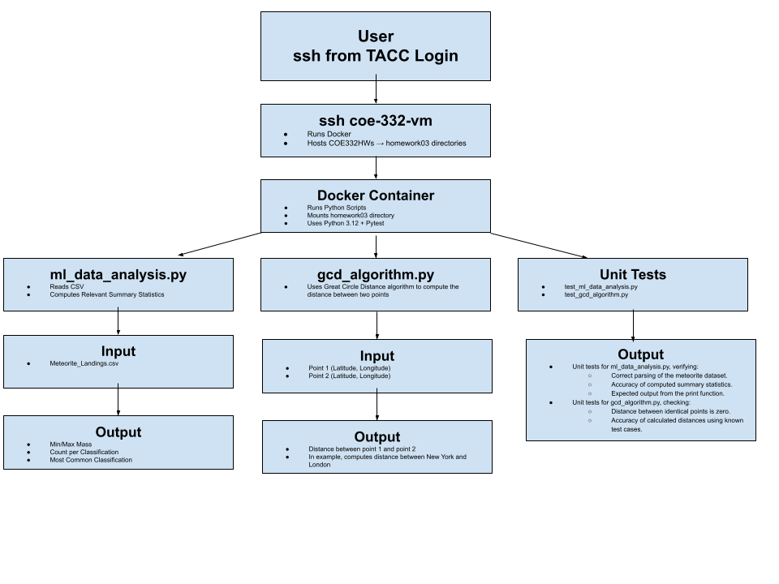

# Meteorite Data Analysis and Great Circle Distance Calculation

## Project Overview

This project contains two main components:

1. **Meteorite Data Analysis**: Processes a meteorite landings dataset to compute key statistics, such as the minimum and maximum mass of meteorites and the most common meteorite classification.
2. **Great Circle Distance Calculation**: This file implements the Haversine formula to compute the great circle distance between two points on Earth based on latitude and longitude.

These scripts help with understanding meteorite landings and perform accurate geographic distance calculations.

## Contents
- **`Dockerfile`**
    - The Dockerfile defines the containerized environment for running the Meteorite Data Analysis and Great Circle Distance scripts. It:
        - Uses Python 3.9 as the base image
        - Sets up the working directory inside the container (/app).
        - Copies all Python scripts into the container
        - Installs necessary dependencies (e.g., pytest for unit testing)
        - Specifies python3 as the default command

- **`diagram.png`**
    - 
    - The diagram above illustrates the overall structure of the Meteorite Data Analysis Homework. It shows how the user connects via SSH to a TACC virtual machine, which runs Docker to containerize the Python scripts. Inside the container, different scripts handle data analysis, great-circle distance calculations, and unit testing. The input dataset (`Meteorite_Landings.csv`) is mounted at runtime, and the results are displayed after execution.

### Python Scripts

- **`ml_data_analysis.py`**

  - Reads meteorite landing data from a CSV file.
  - Computes summary statistics including:
    - Minimum and maximum meteorite mass.
    - Count of meteorites per classification.
    - Most common meteorite classification.
  - Prints the results to the console.

- **`gcd_algorithm.py`**

  - Implements the **great-circle distance formula** (Haversine) to calculate the shortest path between two points on Earth given their latitude and longitude.

- **`test_ml_data_analysis.py`**

  - Unit tests for `ml_data_analysis.py`, verifying:
    - Correct parsing of the meteorite dataset.
    - Accuracy of computed summary statistics.
    - Expected output from the print function.

- **`test_gcd_algorithm.py`**

  - Unit tests for `gcd_algorithm.py`, checking:
    - Distance between identical points is zero.
    - Accuracy of calculated distances using known test cases.

## Downloading the Meteorite Landings CSV File

Before running the analysis, you must download the **Meteorite\_Landings.csv** file.

If you're using a terminal, you can download the file directly using:

```bash
wget -O Meteorite_Landings.csv "https://data.nasa.gov/resource/gh4g-9sfh.csv"
```

Once downloaded, make sure the file is in the same directory as `ml_data_analysis.py`.

## **Docker Execution**
**1. Build the Docker Image**
    ```bash
    docker build -t my_python_container 
    ```
**2. Run the Containerized Data Analysis**

To run the script inside the container:
```bash
docker run --rm -v "$(pwd):/app" my_python_container
```
This will:

- Mount your local directory ($(pwd)) inside the container at /app

- Execute ml_data_analysis.py using the downloaded CSV file

- Output the meteorite data statistics

**3. Run Containerized Unit Tests**

Execute the unit tests inside the container to verify that everything works:
```bash
docker run --rm -it -v $(pwd):/app my_python_container pytest
```

This will:
- Run pytest test_ml_data_analysis.py

- Run pytest test_gcd_algorithm.py

- Confirm that all tests pass successfully

## Executing the Scripts Without Docker

**1. Meteorite Data Analysis**

   ```bash
   python3 ml_data_analysis.py
   ```

   - Reads `Meteorite_Landings.csv`
   - Computes and prints statistics
   - Outputs:
     ```
     Minimum Mass: .15 g
     Maximum Mass: 230000.00 g
     Most Common Classification: H5 (Count: 500)
     ```

**2. Great Circle Distance Calculation**

   ```python
   from gcd_algorithm import great_circle_distance

   distance = great_circle_distance(40.7128, -74.0060, 51.5074, -0.1278)
   print(f"Distance: {distance:.2f} km")
   ```

   - The above code block computes the distance between New York City and London as an example.

**3. Running Tests**

   ```bash
   pytest test_ml_data_analysis.py
   pytest test_gcd_algorithm.py
   ```

   - Verifies correctness of implemented functions.

## AI Usage Disclaimer

I used ChatGPT to help me figure out an error with my mass key in the `ml_data_analysis.py` file. I was having trouble properly converting the mass value to a float, and it ended up being that I was using the wrong key name.

In addition, I used AI to help me format this README file to make it easier to follow along. I asked ChatGPT for various formatting shortcuts and tricks to improve readability. I eventually found a website called readme.so which allows me to better format my README files moving forward.

The reason I used AI for the README is that I’m not yet familiar with all the formatting options available in markdown and wanted to explore different ways to make it look professional. Finding the editor website has also been really helpful in undertanding this.


